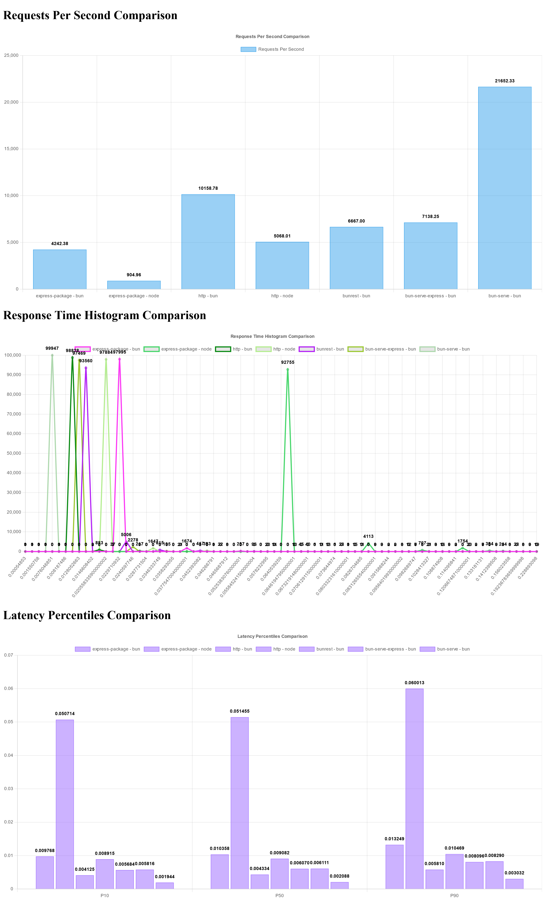

[Back](../readme.md)

# Pi 4

## Specs:
- OS Info: Linux 6.6.51+rpt-rpi-v8 #1 SMP PREEMPT Debian 1:6.6.51-1+rpt3 aarch64 GNU/Linux
- Mem: 1GB

## Program versions
- Bun: 1.2.0
- Node: v22.11.0

[Raw data](data.json)

