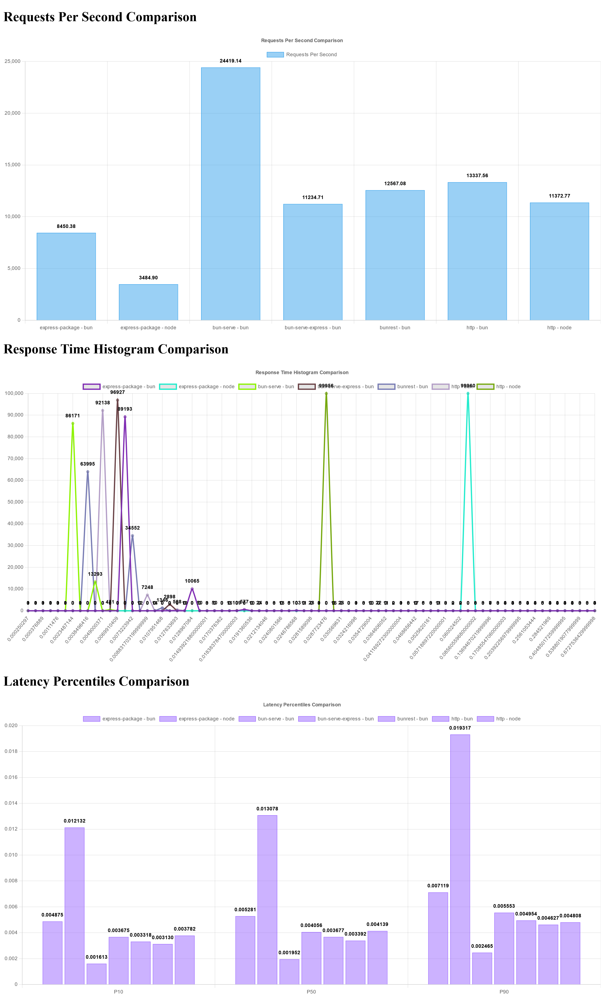

[Back](../readme.md)

# Pi 5

## Specs:
- OS Info: Linux 6.8.0-1017-raspi #19-Ubuntu SMP PREEMPT_DYNAMIC aarch64 aarch64 aarch64 GNU/Linux
- Mem: 8GB

## Program versions
- Bun: 1.2.0
- Node: v22.11.0

[Raw data](data.json)

